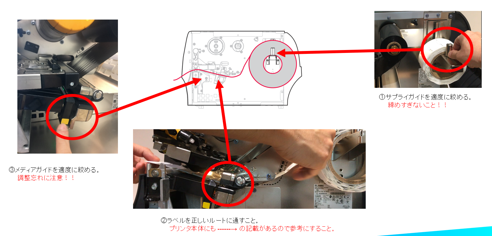
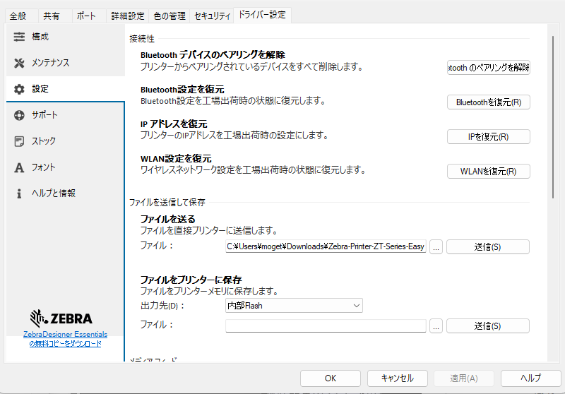
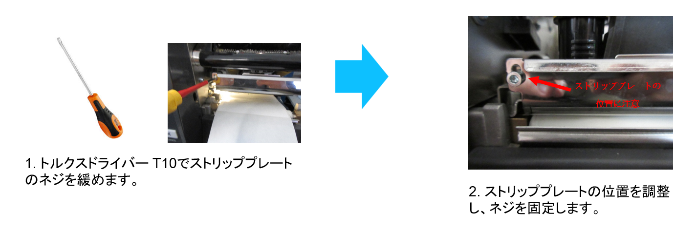
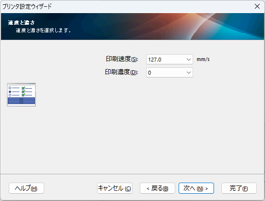

# RFIDプリンタの調整・設定ガイド(ZT411R)

</br>

<!--
_backgroundColor: black
_color: white
-->


## 0. 目次
<hr>

1. 準備
2. 設定ファイルの作成
3. 印字圧力の調整　　
4. サプライの装填
5. ラベルセンサーの調整
6. 基本設定（印刷）
7. 基本設定（RFID）
8. テスト印刷・エンコード
9. 印刷品質の調整
10. その他の設定（通信、用紙オプション）
11. 推奨設定（Syslog、RFID Log）

</br>

## 1. 準備

本手順で必要なマテリアルは下記の通り。

|マテリアル|詳細|備考|
|-|-|-|
| RFIDプリンタ| 最新ファームウェア推奨 | Silverlineラベル利用時は</br>ZT411R 1000mwモデルを使用すること。
| RFIDラベル   |ID: 3.0"</br> OD: 8.0"
| インクリボン | ID: 1.0" (300m or 450m) |[ZT411 スペック](https://www.zebra.com/jp/ja/products/spec-sheets/printers/industrial/zt400-series.html)</br>[ZT411 技術仕様](https://www.zebra.com/content/dam/zebra_dam/en/tech-specs/zt411-tech-specs-en-us.pdf)
| USB ケーブル | PC<-->Printer 接続用
| Windows PC   |下記ソフトウェアがインストール済みであること。</br>- [Zebra Setup Utilities for Windows](https://www.zebra.com/us/en/support-downloads/software/printer-software/printer-setup-utilities.html)</br>- [Zebra Designer 3 Professional](https://www.zebra.com/jp/ja/support-downloads/software/printer-software/zebra-designer-3-downloads.html)
| 清掃キット | 不織布+ IPA 90%以上
| 調整器具 | トルクスドライバ T10


</br>


## 2. 設定ファイルの作成
<hr>

1. 設定用ファイルをダウンロードする。
   [<>Code] > [Local] > [Download ZIP]
   
   https://github.com/shimauma-giken/Zebra-Printer-ZT-Series-Easy-Pinter-Configurator-with-USB
   <br>

3. ZIPを解凍する。

### 「参考」 設定ファイルの構成

   | ファイル名    | 用途 |
   |-|-|
   | DEL_STAMP.ZPL	| USBメモリタイムスタンプ削除用	| 
   | PRT_TEST.ZPL	| 印刷テスト用（印刷のみ）	| 
   | RFID_RO1.zpl	| 印刷テスト用（RFID Read）	| 
   | RFID_RW1.ZPL	| 印刷テスト用（RFID Write）	| 
   | SET_CALB.ZPL	| 設定用（用紙キャリブレーション）	| 
   | SET_DTBR.ZPL	| 設定用（感熱、黒マーク）	| 
   | SET_DTGP.ZPL	| 設定用（感熱、ギャップ）	| 
   | SET_TTBR.ZPL	| 設定用（熱転写、黒マーク）	| 
   | SET_TTGP.ZPL	| 設定用（熱転写、ギャップ）	| 

</br>

### 「参考」ラベルとセンサー

##### 連続紙・レシート
  
  </br>

  ##### ギャップ・ノッチ
  
  </br>

  ##### 黒マーク
  
  </br>
    </br>


## 3. 印字圧力の調整　　
<hr>


下記表を参考に印字圧力をラベル幅に合わせて調整する。</br>  *
ZT421や詳細については下記リンクを参考にすること。  
[印字ヘッド圧力の調整](https://docs.zebra.com/jp/ja/printers/industrial/zt411-zt421-industrial-printer-user-guide/c-zt4x1-configuration/r-zt4x1-adjust-the-printhead-pressure.html)


### 表：標準ラベル
| ラベル幅 | 圧力値（内側）   | 圧力値（外側）|
|:-:|:-:|:-:|
|  25 mm   	|  4	|   1	| 
| 51 mm	    |  3	|   1	| 
| 76 mm 	| 2.5	|   1.5	| 
|  ≥89 mm	|  2	|   2	| 

\* Silverline ラベルの場合は次頁を参考にすること。


</br>

## 3. 印字圧力の調整 （Silverline）
<hr>


下記表を参考に印字圧力をラベル幅に合わせて調整。


### 表：Silverline ラベル
| ラベル幅 | 圧力値（内側）   | 圧力値（外側）|
|:-:|:-:|:-:|
|  MircoⅡ   	|  2	|   1	| 
| BladeⅡ	    |  2	|   1.5	| 
| SlimⅡ	| 2	|   2	| 
|  ClassicⅡ	|  2	|   2	| 

</br>

※ Sliverline ラベルはZT411 On-Metal モデルのみ利用可能です。


</br>

## 4. サプライの装填（リボン）
<hr>


</br>

下記点に注意しながら、リボンを装填する。
- リボンは外巻きを推奨
- リボンの取り付け方向
- リボンの通り道（PHDの下を通るように）
  
詳細な手順は下記リンクを参考にすること。  
[リボンのセット](https://docs.zebra.com/jp/ja/printers/industrial/zt411-zt421-industrial-printer-user-guide/c-zt4x1-setup/t-zt4x1-loading-the-ribbon.html)

</br>

### 👉 Silverlineラベルとリボンの対応表

<table>
  <thead>
    <tr>
      <th>製品名</th>
      <th>サイズ（mm）</th>
      <th>厚み（mm）</th>
      <th>RFチップ</th>
      <th>メモリ構成</th>
      <th>対応リボン</th>
    </tr>
  </thead>
  <tbody>
    <tr>
      <td>Classic II</td>
      <td>100 × 40</td>
      <td>1.3</td>
      <td>M730</td>
      <td>EPC 128bit</td>
      <td>(S)05095BK110xx</td>
    </tr>
    <tr>
      <td>Blade II</td>
      <td>060 × 25</td>
      <td>1.3</td>
      <td>M730</td>
      <td>EPC 128bit</td>
      <td>(S)05095BK083xx</td>
    </tr>
    <tr>
      <td>Blade II+</td>
      <td>060 × 25</td>
      <td>1.3</td>
      <td>M780</td>
      <td>EPC 496bit / User 128bit</td>
      <td>(S)05095BK083xx</td>
    </tr>
    <tr>
      <td>Slim II</td>
      <td>100 × 13</td>
      <td>1.3</td>
      <td>R6-P</td>
      <td>EPC 96/128bit / User 32/64bit</td>
      <td>(S)05095BK110xx</td>
    </tr>
    <tr>
      <td>Micro II</td>
      <td>045 × 13</td>
      <td>1.3</td>
      <td>R6-P</td>
      <td>EPC 96/128bit / User 32/64bit</td>
      <td>(S)05095BK060xx</td>
    </tr>
  </tbody>
</table>

</br>

## 4. サプライの装填（ラベル）
<hr>


下記点に注意しながら、リボンを装填する。
- ラベルは外巻きを推奨
- ラベルの通り道（リボン・PHDの下を通るように）

詳細な手順は下記リンクを参考にすること。  
[プリンタへの用紙の挿入](https://docs.zebra.com/jp/ja/printers/industrial/zt411-zt421-industrial-printer-user-guide/c-zt4x1-setup/c-zt4x1-load-the-media/t-zt4x1-inserting-the-media-into-the-printer.html)

</br>


## 4. サプライの装填（ラベル）

ラベルが蛇行しないように下記3点を確認すること。  



</br>


## 5. ラベルセンサーの調整

ラベルには様々な形状や大きさのものがある。ラベルセンサーをラベルの形状、タイプに合わせて、**適切にポジショニング**すること。
<br>


</br>


- ラベルセンサーはLED点灯位置を頼りに設定すること。
- 詳細な手順は下記リンクを参考にすること。   
[用紙センサー位置の調整](https://docs.zebra.com/jp/ja/printers/industrial/zt411-zt421-industrial-printer-user-guide/c-zt4x1-configuration/t-zt4x1-adjusting-the-sensor-position.html)

<br>
</br>

<table>
  <thead>
    <tr>
      <th>センサーの稼働方法</th>
      <th>センサー位置の確認方法</th>
    </tr>
  </thead>
  <tbody>
    <tr>
      <td>
        
      </td>
      <td>
        
      </td>
    </tr>
  </tbody>
</table>


</br>

## 6. 基本設定（印刷）
<hr>




1. プリンタとPCをUSBケーブルで接続。
1. Zebra Setup Utilities for Windows（以降ZSU） を使用して適切な設定ファイルを送付する。
   ```
   ZSU > [プリンタツールを開く] > [設定] > [ファイルを送る] > "任意のファイルを選択" > [送信]
   ```


   | ファイル名    | 用途 |
   |-|-|
   | SET_DTBR.ZPL	| 設定用（感熱、黒マーク）	| 
   | SET_DTGP.ZPL	| 設定用（感熱、ギャップ）	| 
   | SET_TTBR.ZPL	| 設定用（熱転写、黒マーク）	| 
   | SET_TTGP.ZPL	| 設定用（熱転写、ギャップ）	| 

   <br>

1. 用紙キャリブレーションが完了するまで待つ。
1. キャリブレーションの正常性を確認する。

<br>

**※ 用紙キャリブレーションができない場合はマニュアルキャリブレーションを実施すること。**  
[参考：Youtube: ZT411 Printer: Ribbon and Media Calibration /Zebra](https://www.youtube.com/watch?v=-80-NPebwGA)
</br>
</br>


## 7. 基本設定（RFID）


1. 用紙キャリブレーションが完了していることを確認。
2. プリンタ液晶 > [RFID] > [RFID Calibrate] を選択。
3. RFID キャリブレーションが完了するまで待つ。
4. エラーが発生していないことを確認する。

### RFID キャリブレーションが失敗するときは。。。。
1. 用紙キャリブレーションが適切か
1. 用紙設定が適切か
1. RFIDキャリブレーション中に用紙詰まりが発生していないか


<a href="https://docs.zebra.com/jp/ja/printers/industrial/zt411-zt421-industrial-printer-user-guide/c-zt4x1-configuration/r-changing-printer-settings/r-zt4x1-user-menus/r-zt4x1-rfid-menu.html" target="_blank">参考：RFID メニュー</a>


</br>

## 10. テスト印刷・エンコード

1. Zebra Setup Utilities for Windows（以降ZSU） を使用して適切な設定ファイルを送付する。
   ZSU > [プリンタツールを開く] > [設定] > [ファイルを送る] > "下記表のファイルを選択" > [送信]
1. Void やエラーが発生しないことを確認する。
<br>


## テスト用ファイル
| ファイル名    | 用途 |
|-|-|
| PRT_TEST.ZPL	| 印刷テスト用（印刷のみ）	| 
| RFID_RO1.zpl	| 印刷テスト用（RFID Read）	| 
| RFID_RW1.ZPL	| 印刷テスト用（RFID Write）	| 

※ テストファイルはZebra Designer 3 Pro/Developerで作成してもOK。


</br>

## VOID発生原因 TOP5
<hr>

1. 不適切な用紙調整、用紙ジャム
   - ラベルセンサーの位置
   - 用紙設定
   - 印字圧力調整
2. 用紙・RFIDキャリブレーションの未実施
3. 不適切なSKU
   - 電波出力
   - 標準/Silverline
4. ストリッププレート調整
5. Win ドライバによる設定上書き
</br>

## VOID発生時の確認ポイント
<hr>

1. SKU
2. Firmware
3. 用紙センサー、設定、キャリブレーション
4. ラベルジャム、ラベル詰まり
5. 印字ヘッド周囲の汚れ
6. ストリッププレートの位置



</br>

## VOID発生時の切り分け時に便利なコマンド

1. RFID キャリブレーション
   ```zpl
    ^XA^HR^XZ
    ```
    - 用紙調整、ラベルジャム、詰まり
    - 電波強度
  

2. RFID ログ
   ```shell
   ! U1 setvar "rfid.log.enabled" "yes"
   ! U1 getvar "rfid.log.entries"
   ```
   - VOIDのエラーコード

3. RFID 設定一覧
   ```
   ! U1 getvar "rfid"
   ```


</br>

## 8. 印刷品質の調整



印刷対象のラベルに応じて、適切な設定をする。

- ラベルサイズ
- 印字濃度
- 印字速度
- ラベル用紙の種類

</br>

## 9. その他の設定（通信、用紙オプション）

その他、付属オプションに応じて、適切な設定をすること。

1. 用紙オプション設定
   - カッター
   - ピーラー
   - リワインダー
2. 通信オプション設定
   - Ethernet
   - Bluetooth 
   - Wi-Fi
3. フォントファイルのインストール
   - 日本語フォントなど


</br>

<br>
<br>
<br>

# プリンタは工業製品です。適切な手順を踏むことで、適切な動作をする仕様です。
#### 大半のVOIDエラーは適切に設定・調整をしていないことによって発生しています。
#### 行き詰ったら、立ち止まって、ガイドを見直して、未対応項目がないか確認しましょう。


